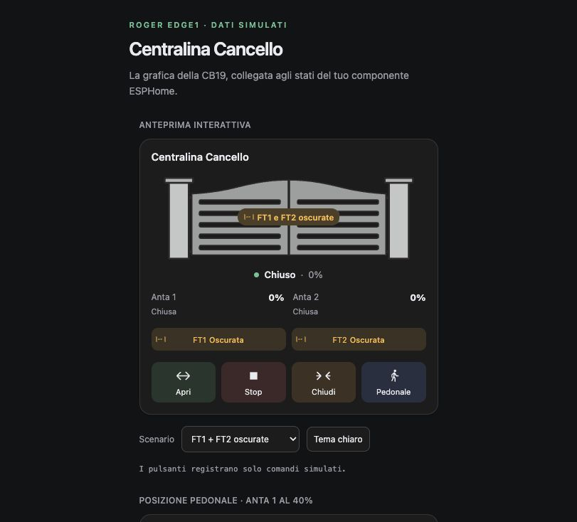

# Roger EDGE1 Card 1.1.0

Card per Home Assistant dedicata alle centraline **Roger Technology EDGE1** e al componente ESPHome [esphome-roger-edge1](https://github.com/branda92/esphome-roger-edge1) v0.3.0. Derivata da [CB19 ESPHome Card di Zoltán Szőke](https://github.com/szokezoltan95/CB19-esphome-card), licenza MIT; riferimento `0e4505aa464b7efa0c71c459b80dbd4bb4f23415`.

La grafica a due ante e le opzioni di stile provengono dal progetto originale. La lettura degli stati, il riconoscimento delle entità e la gestione dei comandi sono adattati alla EDGE1. Il firmware ESPHome non deve essere modificato per usare la card.

## Anteprima



Le anteprime della versione 1.1.0 usano dati simulati. Vedi anche la [posizione pedonale al 40%](preview/card-parziale.png).

## Installazione con HACS

Il repository è predisposto per l’aggiunta come **repository personalizzato** di tipo **Dashboard**; non è incluso nel catalogo predefinito di HACS.

1. In **HACS → ⋮ → Repository personalizzati**, aggiungi `https://github.com/branda92/roger-edge1-card` e scegli **Dashboard**.
2. Cerca **Roger EDGE1 Card**, scarica la versione disponibile e ricarica Home Assistant nel browser.
3. Controlla che nelle risorse della dashboard sia presente `/hacsfiles/roger-edge1-card/roger-edge1-card.js` come **Modulo JavaScript**. Se manca, aggiungila manualmente.
4. Aggiungi una **card Manuale** alla dashboard e usa la configurazione descritta sotto.

Riferimenti ufficiali: [repository personalizzati HACS](https://hacs.xyz/docs/faq/custom_repositories/) e [struttura dei plugin Dashboard](https://hacs.xyz/docs/publish/plugin/).

## Installazione manuale

1. Scarica **`roger-edge1-card.js`** dalla [release](https://github.com/branda92/roger-edge1-card/releases/latest), oppure usa [`dist/roger-edge1-card.js`](dist/roger-edge1-card.js), e copialo in **`/config/www/roger-edge1-card.js`** su Home Assistant. Il bundle include i testi delle licenze e le attribuzioni. Se crei `www` per la prima volta, riavvia Home Assistant.
2. Apri **Impostazioni → Dashboard → ⋮ → Risorse** (attiva la modalità avanzata nel tuo profilo se necessario). Aggiungi:
   - URL: `/local/roger-edge1-card.js?v=1.1.0`
   - Tipo: **Modulo JavaScript**.
3. Ricarica la pagina o l'app Home Assistant.
4. Modifica la dashboard, aggiungi una **card Manuale** e incolla il contenuto di [`examples/centralina-cancello.yaml`](examples/centralina-cancello.yaml).

## Configurazione della card

Configurazione minima, da completare con il tuo ID dispositivo:

```yaml
type: custom:roger-edge1-card
device_id: INSERISCI_ID_DISPOSITIVO
motor1_side: left
```

Trovi l’ID aprendo il dispositivo ESPHome in **Impostazioni → Dispositivi e servizi → Dispositivi**: è la parte finale dell’URL `/config/devices/device/…`. Sostituisci `INSERISCI_ID_DISPOSITIVO` in tutti gli esempi prima di usarli.

`motor1_side` indica il lato del disegno assegnato ad Anta 1: scegli `right` se nella vista desiderata è a destra. Non modifica il motore né il comando pedonale.

La risorsa si registra anche in dashboard YAML con:

```yaml
lovelace:
  resources:
    - url: /local/roger-edge1-card.js?v=1.1.0
      type: module
```

Questo blocco riguarda la configurazione Lovelace globale, non il YAML della singola card. La registrazione dalla UI e quella YAML sono due alternative. Riferimenti: [risorse custom](https://developers.home-assistant.io/docs/frontend/custom-ui/registering-resources/) e [custom card](https://developers.home-assistant.io/docs/frontend/custom-ui/custom-card/).

## Associazione alle tue entità

Con `device_id` la card legge il registro delle entità di Home Assistant e considera **solo quel dispositivo**. Usa i nomi originali ESPHome, perciò riconosce sia gli ID lunghi iniziali sia quelli rinominati come `button.centralina_cancello_apri`. Una notifica di modifica del registro aggiorna l'associazione; se la notifica non è disponibile, ricarica la dashboard.

Non crea, rinomina o abilita entità. Se ci sono due entità compatibili con lo stesso ruolo, segnala l'ambiguità e richiede la relativa associazione esplicita. Un dispositivo eliminato e riaggiunto potrebbe avere un nuovo `device_id`.

Puoi sovrascrivere uno o più ruoli senza specificarli tutti:

```yaml
type: custom:roger-edge1-card
device_id: INSERISCI_ID_DISPOSITIVO
entities:
  open_button: button.centralina_cancello_apri
```

La mappa completa è illustrata in [`examples/entita-esplicite.yaml`](examples/entita-esplicite.yaml): **gli ID di quell'esempio sono proposti, non verificati sul sistema live**. Senza `device_id`, tutte le entità necessarie vanno indicate manualmente. `show_debug: true` mostra le associazioni risolte e l'ultimo esito del componente.

## Funzioni e significato degli stati

- Due ante animate separatamente, basate su **Posizione Anta 1** e **Posizione Anta 2** (percentuali già filtrate dal firmware). Nessun tempo di corsa inventato.
- Apri, Stop, Chiudi e Pedonale inviano ciascuno un solo `button.press` al pulsante corrispondente. La risposta al servizio non simula l'avvenuta apertura e non viene ritentata automaticamente.
- Le etichette di stato derivano dai codici delle ante, oppure dai sensori testuali se i codici non sono presenti. I movimenti prevalgono sullo stato fermo dell'altra anta.
- **FT1** e **FT2** restano separate e possono essere entrambe oscurate. Se i sensori binari non sono associati, il registro raw `0x1711` fornisce i bit `0x0010` e `0x0020`; `0x0030` attiva entrambe.
- Un sensore configurato con valore `unknown`/`unavailable` viene mostrato come **Non disponibile**, senza sostituirlo con un vecchio valore raw.
- Il segnale **EDGE1 Collegata** determina l'attualità della telemetria del cancello. Quando è spento, le posizioni precedenti vengono nascoste e i movimenti sono disabilitati; Stop resta disponibile se ESPHome è raggiungibile. Se cade la connessione HA, tutti i comandi sono disabilitati.
- Le fotocellule mostrano i loro stati indipendenti: la gestione delle sicurezze resta nella centralina.
- **Pedonale è un comando, non uno stato dedicato confermato dal protocollo**. Puoi configurare il riconoscimento della posizione pedonale come descritto sotto: l’etichetta indica una posizione delle ante, non quale comando l’abbia prodotta.
- Nessun cursore di posizione, poiché il protocollo implementato non dispone del comando di destinazione percentuale.
- L'ingranaggio apre la pagina del tuo dispositivo, dove è già disponibile Parametro 80. La card non ne cambia il valore né gli attribuisce funzioni non confermate.

## Posizione pedonale

Il sensore **Posizione Cancello** esprime la posizione complessiva: con Anta 1 al 40% e Anta 2 allo 0%, normalmente vale 20%. Le due percentuali hanno quindi riferimenti diversi.

Per mostrare **«Posizione pedonale · 40%»** quando la tua anta pedonale è nella posizione prevista, aggiungi alla configurazione della card:

```yaml
pedestrian_position:
  motor: 1
  position: 40
  tolerance: 1
```

- `motor`: anta pedonale, `1` o `2` (predefinito: `1`). È il numero del motore, indipendente da `motor1_side`.
- `position`: apertura pedonale configurata, maggiore di 0 e minore di 100. Il valore 40 è un esempio da adattare alla propria installazione.
- `tolerance`: scostamento ammesso in punti percentuali, da 0 a 5 (predefinito: 1); usato anche per verificare che l’altra anta sia vicina allo 0%.

L’etichetta compare solo con la centralina collegata, posizioni note, anta pedonale ferma (aperta o arrestata) e altra anta indicata come chiusa. Durante il movimento o con dati sconosciuti rimangono gli stati ordinari. Anche un arresto manuale nella stessa posizione può corrispondere a «Posizione pedonale».

In questa condizione il riepilogo mostra la percentuale **misurata dell’anta pedonale**, arrotondata come le altre percentuali; non forza una lettura diversa dal sensore. I dettagli delle due ante e il sensore complessivo di Home Assistant conservano i propri valori. Senza il blocco `pedestrian_position`, rimane il riepilogo complessivo precedente.

## Aspetto

`ui.view_mode` può essere `hybrid` (grafica, dettagli ante e sensori), `graphic` (più compatta), oppure `text` (senza disegno). I comandi e le fotocellule restano presenti.

Sono mantenute le opzioni CB19 per `ui.header`, `ui.settings_button`, `ui.controls`, `ui.icons`, `ui.icon_tune`, `ui.colors`, `ui.effects` e `ui.padding`; vedi `src/utils/ui-config.ts` per i valori predefiniti. Ogni sezione accetta modifiche parziali. I testi sono in italiano, i colori seguono il tema HA e l'animazione rispetta la preferenza di movimento ridotto del browser.

Esempio compatto:

```yaml
type: custom:roger-edge1-card
device_id: INSERISCI_ID_DISPOSITIVO
ui:
  view_mode: graphic
  header:
    enabled: false
  padding:
    card: 10px
```

## Anteprima e sviluppo

`demo/index.html` usa solo dati simulati: non contiene credenziali e non si collega al cancello. Per aprirla dal pacchetto estratto:

```sh
python3 -m http.server 8767 --bind 127.0.0.1
```

Apri `http://127.0.0.1:8767/demo/`. La pagina permette di scegliere diversi stati, cambiare tema e provare i pulsanti come chiamate simulate. Sono incluse anche immagini di anteprima in `preview/`.

Per modificare e ricompilare: Node.js 22.12 o successivo (consigliata una versione LTS), poi `npm ci`, `npm test`, `npm run build`. Il bundle contiene Lit: non richiede HACS, card-mod, button-card, altre custom card o una CDN. Per i test browser usa `npm run test:browser` con Google Chrome installato. I test avviano una demo isolata su `127.0.0.1:8768`. Il file `hacs.json` e il bundle in `dist/` consentono la distribuzione tramite repository personalizzato HACS. Non occorre compilare il progetto per installare la card.

Vedi `TEST_RESULTS.md` per le verifiche e i limiti del collaudo.
